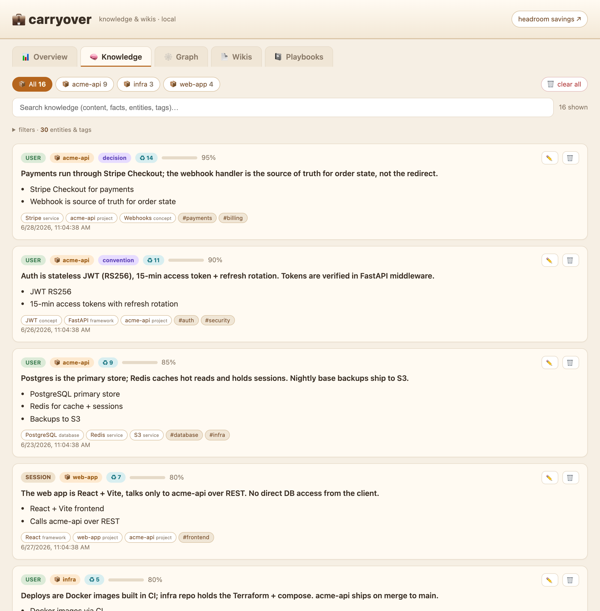
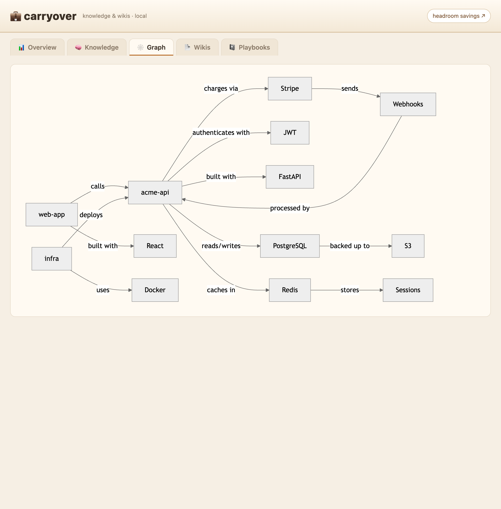
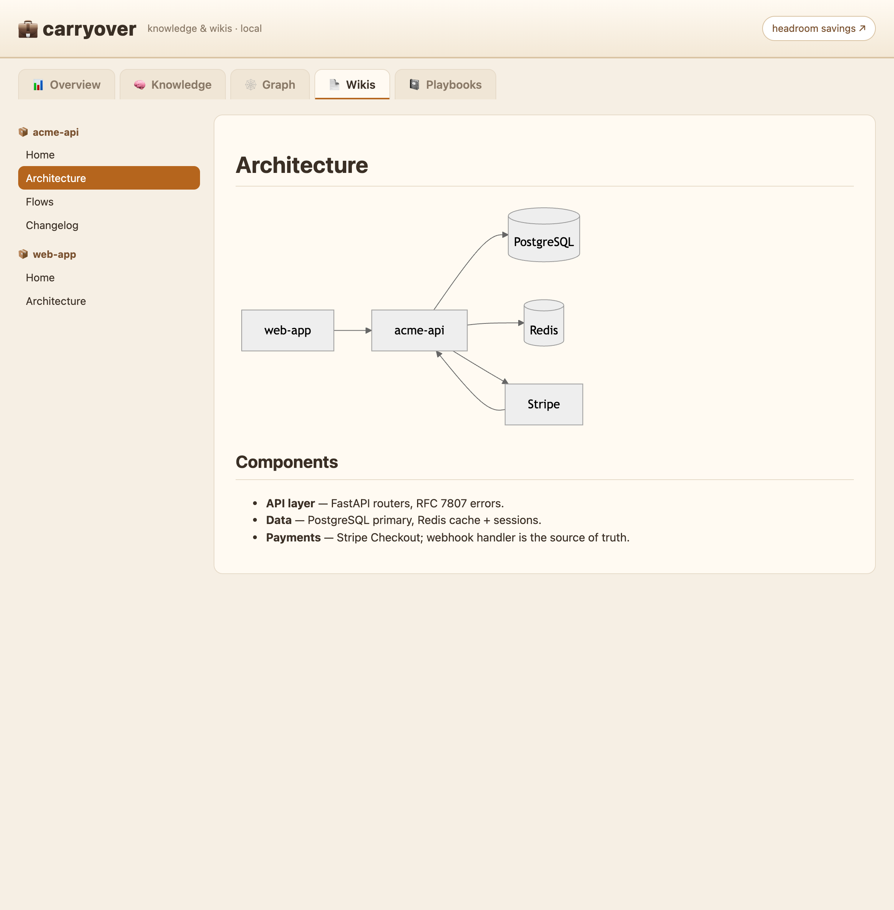

<div align="center">

<h2>💼</h2>

<pre>
 ██████╗ █████╗ ██████╗ ██████╗ ██╗   ██╗ ██████╗ ██╗   ██╗███████╗██████╗
██╔════╝██╔══██╗██╔══██╗██╔══██╗╚██╗ ██╔╝██╔═══██╗██║   ██║██╔════╝██╔══██╗
██║     ███████║██████╔╝██████╔╝ ╚████╔╝ ██║   ██║██║   ██║█████╗  ██████╔╝
██║     ██╔══██║██╔══██╗██╔══██╗  ╚██╔╝  ██║   ██║╚██╗ ██╔╝██╔══╝  ██╔══██╗
╚██████╗██║  ██║██║  ██║██║  ██║   ██║   ╚██████╔╝ ╚████╔╝ ███████╗██║  ██║
 ╚═════╝╚═╝  ╚═╝╚═╝  ╚═╝╚═╝  ╚═╝   ╚═╝    ╚═════╝   ╚═══╝  ╚══════╝╚═╝  ╚═╝
</pre>

<strong>Pack your context once — carry it across every AI tool.</strong><br/>
<sub><em>like a carry-on for your AI's brain 💼</em></sub>

<sub>shared persistent memory · 60–95% fewer tokens · leaner agent · auto-wiki · save-to-memory<br/>
Claude Code · Cursor · Windsurf · Conductor — one install · 100% local</sub>

<p>
<a href="LICENSE"></a>


<a href="https://github.com/chopratejas/headroom"></a>
<a href="https://github.com/DietrichGebert/ponytail"></a>
<a href="https://github.com/Cfvillarroel/carryover/stargazers"></a>
</p>

<strong><a href="#english">English</a> · <a href="#español">Español</a> · <a href="#install">Install</a></strong>

</div>

---

# English

## The problem

You don't work in a single AI tool anymore — Claude Code one day, Cursor or Windsurf
the next, Conductor for parallel work. But **context doesn't travel with you**: every
tool, project and session starts from zero, so you re‑explain the same codebase over and
over. On top of that each agent **burns tokens** on bloated context, **forgets**
everything between sessions, and tends to **over‑engineer** — and the few things worth
remembering never get captured. Wiring up the fix by hand is fiddly and has to be redone
on every machine.

## The fix

A local layer that makes your context **carry over** across tools, projects and sessions:

- 🧠 **[headroom](https://github.com/chopratejas/headroom)** — context‑compression proxy
  (60–95% fewer tokens) + **shared, persistent memory** across all your repos.
- 🐴 **[ponytail](https://github.com/DietrichGebert/ponytail)** — keeps the agent from
  over‑engineering (simplest solution that works).
- Status bar **🐴/🧠**, `/headroom` command, terminal aliases.
- **Auto‑wiki** on push to master/main (an LLM writes docs + mermaid diagrams).
- **Save‑what‑mattered prompt** at the end of each session.

One idempotent install, the **real upstream tools** (no forks), **global by design** — so
your context follows you instead of resetting.

## Works with

The shared memory + compression work with any agent that routes through the local proxy:

| Tool | Compression + shared memory | Claude extras (🐴/🧠, `/headroom`, save‑to‑memory) |
|------|:---------------------------:|:---:|
| Claude Code | ✅ auto (installer) | ✅ |
| Conductor | ✅ auto (runs Claude Code) | ✅ |
| Cursor | ✅ `headroom wrap cursor` (paste config) | — |
| Windsurf / Devin | ✅ OpenAI‑compatible → base URL `http://127.0.0.1:8787/v1` | — |
| Codex / Copilot / Aider / Cline / Continue / Goose | ✅ `headroom wrap <tool>` | — |

## Install

```bash
git clone https://github.com/Cfvillarroel/carryover.git ~/carryover
bash ~/carryover/install.sh
```

Requirements: macOS · `brew install python@3.13` · Claude Code (`claude`) on PATH.
Then open a new terminal (or `source ~/.zshrc`) and restart Claude.

The installer is **idempotent** and:
1. installs headroom in `~/.headroom/venv` (Python 3.13) + `headroom install apply --memory`
   → persistent proxy (launchd), Claude routing, shared memory;
2. installs the `ponytail` and `headroom` Claude plugins;
3. symlinks the status bar, `/headroom` command and hooks, sets `statusLine`;
4. adds aliases to `~/.zshrc`.

> ⚠️ headroom doesn't build on Python 3.14 (Rust/PyO3 extension) — the venv uses 3.13.

**Not on Claude Code?** carryover isn't Claude-only. The headroom proxy is shared, so the
memory + compression apply to **any** tool once it's running — Cursor, Windsurf, Codex,
Aider… you just point each one at the proxy (see [Works with](#works-with) for the
one-liner per tool). `install.sh`'s Claude-specific extras (status bar, `/headroom`, the
plugins) are for Claude Code / Conductor; everything else shares the same proxy + memory.

### Install just the Claude plugin (optional)

Only want the Claude-side commands + the save-to-memory prompt, without the full installer?

```bash
claude plugin marketplace add Cfvillarroel/carryover
claude plugin install carryover@carryover
```

You still need the headroom proxy for memory/compression:
`pip install "headroom-ai[all]" && headroom install apply --memory`.

## Scope: global vs per‑repo

- **Global (once per Mac):** headroom proxy + memory + Claude config. Global **by
  design** — that's what makes context shared across all repos and tools.
- **Per repo / a set of repos:** the **wiki** capability — run `wiki-enable` in each repo
  you want (one, several or all). It installs a `pre-push` hook there only.
- Memory is global but internally scoped: `USER` = shared across repos, `project` = per
  workspace.

## Easy commands

| Alias | Does |
|-------|------|
| `hr` | headroom CLI |
| `hr-status` | proxy up / healthy? |
| `hr-mem` | stored memories |
| `hr-stats` | memory summary |
| `hr-save` | tokens saved |
| `mem-save "text"` | save a memory by hand (or structured `--json`) |
| `hr-recall <query>` | recall knowledge by keyword |
| `co-dash` | open the local dashboard (knowledge + wikis) |
| `hr-dash` | open headroom's savings dashboard |
| `hr-prune …` | prune memories (e.g. `--older-than 30d --dry-run`) |
| `carryover doctor` | health-check the whole setup |
| `carryover wrap <tool>` | route another tool (Cursor, Codex…) through the proxy |
| `hr-on` / `hr-off` | start / stop the proxy |

**Auto-recall:** when you start a session in a repo, carryover injects *what it already
knows about that repo* as context — so the knowledge actually comes back, not just gets stored.

Inside Claude (any workspace): `/headroom` (proxy + memory + savings), `/carryover` (routing on/off/status), `/recall <query>`, `/wiki-enable`.
Status bar: **🐴** ponytail active, **🧠** headroom active.

## Dashboards (local)

Two local web dashboards — nothing leaves your machine:

- **`co-dash`** → carryover's own dashboard at `http://127.0.0.1:8788` — browse your
  **knowledge** (facts, typed entities, tags, with search + entity/tag filters),
  **grouped by the repo** it came from (or *general*), an auto-built **relationship
  graph**, and your project **wikis** (Markdown + mermaid). It's also a **manager**:
  delete a single memory or clear a whole repo with one click. Reads/writes your DB live; Ctrl-C to stop.
- **`hr-dash`** → headroom's **savings** dashboard at `http://127.0.0.1:8787/dashboard` —
  tokens saved, compression, cache hit rate.

<sub>(Screenshots below use fictitious data. Wikis appear in `co-dash` after you run
`wiki-enable` in a repo and push to master/main.)</sub>

| Knowledge | Graph | Wikis |
|---|---|---|
|  |  |  |

## Enable / disable routing

Routing is **ON by default** for every new session. Toggle it without uninstalling (the
proxy keeps running):

```bash
carryover off            # new sessions go straight to Anthropic (global)
carryover on             # route through headroom again (global)
carryover off --session  # only the current terminal
carryover status         # show state
```

`off` is surgical and reversible: it drops the routing env and guards headroom's
SessionStart hook so it won't re‑add it; `on` reverts.

## Memory

```bash
hr memory stats --db-path ~/.headroom/memory.db    # (the hr-* aliases already pass this)
hr memory list  --db-path ~/.headroom/memory.db --scope USER
mem-save "what you want to remember"
```

> The `headroom memory` CLI defaults to `./headroom_memory.db` in the current dir, **not**
> the proxy store — that's why the aliases pass `--db-path ~/.headroom/memory.db`.

## Auto‑wiki (local, GitHub‑Wiki format)

Regenerates a project wiki **on push to master/main** using headless Claude (`claude -p`)
to read the diff and draw mermaid diagrams. Local by default; publishing to the GitHub
wiki is optional.

```bash
cd /path/to/your/repo && wiki-enable     # installs a pre-push hook + wiki/gen-wiki.sh
bash wiki/gen-wiki.sh                     # regenerate by hand
WIKI_PUBLISH=1 bash wiki/gen-wiki.sh      # also push to the GitHub wiki
```

## Manage / uninstall headroom

```bash
hr install status | start | stop | restart
hr install remove        # remove service + routing (back to direct Anthropic)
```

⚠️ If the proxy is down, Claude sessions fail until `hr-on` (or `hr install remove`).

## Direct install (without this repo)

```bash
pip install "headroom-ai[all]" && headroom install apply --memory
claude plugin marketplace add DietrichGebert/ponytail && claude plugin install ponytail@ponytail
```

carryover is more than a bundle: on top of a one‑command idempotent install, it adds its
own layer — cross‑tool memory wiring, the 🐴/🧠 status bar, the `/headroom` command, the
save‑to‑memory system (Stop hook + `mem-save`, since headroom has no `memory add` CLI),
the **auto‑wiki** (`claude -p` → GitHub‑Wiki docs with mermaid), and the `carryover`
routing toggle.

## Troubleshooting

- **Claude hangs / fails** → proxy down? `hr-status`; if so, `hr-on`.
- **No compression in a session** → `echo $ANTHROPIC_BASE_URL` empty = old session, restart it.
- **`pip install` fails** → use Python 3.13 (not 3.14): `brew install python@3.13`.
- **`headroom install apply` fails with a `launchctl` error** → run `install.sh` from your
  **real Terminal app**, not an SSH/automation/agent shell — macOS launchd (GUI domain) needs
  an interactive session. The installer keeps going regardless; just re-run apply in Terminal.
- **Don't delete `~/.headroom/venv`** before `hr install remove` — it backs the service.

---

# Español

## El problema

Ya no trabajas en una sola herramienta de IA — hoy Claude Code, mañana Cursor o Windsurf,
Conductor para trabajo en paralelo. Pero **el contexto no viaja contigo**: cada
herramienta, proyecto y sesión empieza de cero, así que re‑explicas el mismo código una y
otra vez. Encima cada agente **quema tokens** con contexto inflado, **olvida** todo entre
sesiones y tiende a **sobre‑diseñar** — y lo poco que vale la pena recordar nunca se
captura. Y dejar el arreglo listo a mano es engorroso y hay que repetirlo en cada Mac.

## La solución

Una capa local que hace que tu contexto **se traspase** (*carry over*) entre herramientas,
proyectos y sesiones:

- 🧠 **[headroom](https://github.com/chopratejas/headroom)** — proxy de compresión de
  contexto (60–95% menos tokens) + **memoria compartida y persistente** entre todos tus repos.
- 🐴 **[ponytail](https://github.com/DietrichGebert/ponytail)** — evita que el agente
  sobre‑diseñe (la solución más simple que funciona).
- Barra de estado **🐴/🧠**, comando `/headroom`, aliases de terminal.
- **Wiki automática** al hacer push a master/main (un LLM escribe docs + diagramas mermaid).
- **Pregunta de "guardar lo importante"** al final de cada sesión.

Un instalador idempotente, las **herramientas reales** (sin forks), **global por diseño** —
para que tu contexto te siga en vez de reiniciarse.

## Funciona con

La memoria compartida + compresión funcionan con cualquier agente que pase por el proxy local:

| Herramienta | Compresión + memoria compartida | Extras de Claude (🐴/🧠, `/headroom`, guardar en memoria) |
|-------------|:-------------------------------:|:---:|
| Claude Code | ✅ auto (instalador) | ✅ |
| Conductor | ✅ auto (corre Claude Code) | ✅ |
| Cursor | ✅ `headroom wrap cursor` (pega la config) | — |
| Windsurf / Devin | ✅ OpenAI‑compatible → base URL `http://127.0.0.1:8787/v1` | — |
| Codex / Copilot / Aider / Cline / Continue / Goose | ✅ `headroom wrap <tool>` | — |

## Instalar

```bash
git clone https://github.com/Cfvillarroel/carryover.git ~/carryover
bash ~/carryover/install.sh
```

Requisitos: macOS · `brew install python@3.13` · Claude Code (`claude`) en el PATH.
Luego abre una terminal nueva (o `source ~/.zshrc`) y reinicia Claude.

El instalador es **idempotente** y:
1. instala headroom en `~/.headroom/venv` (Python 3.13) + `headroom install apply --memory`
   → proxy persistente (launchd), routing de Claude, memoria compartida;
2. instala los plugins `ponytail` y `headroom` en Claude;
3. symlinkea la barra de estado, el comando `/headroom` y los hooks, fija el `statusLine`;
4. añade los aliases a `~/.zshrc`.

> ⚠️ headroom no compila en Python 3.14 (extensión Rust/PyO3) — el venv usa 3.13.

**¿No usas Claude Code?** carryover no es solo para Claude. El proxy de headroom es
compartido, así que la memoria + compresión aplican a **cualquier** herramienta una vez
corriendo — Cursor, Windsurf, Codex, Aider… solo apuntas cada una al proxy (mira
[Funciona con](#funciona-con) para el one-liner por herramienta). Los extras específicos
de Claude del `install.sh` (barra de estado, `/headroom`, los plugins) son para Claude
Code / Conductor; lo demás comparte el mismo proxy + memoria.

### Instalar solo el plugin de Claude (opcional)

¿Solo quieres los comandos de Claude + el prompt de guardar-en-memoria, sin el instalador completo?

```bash
claude plugin marketplace add Cfvillarroel/carryover
claude plugin install carryover@carryover
```

Igual necesitas el proxy de headroom para memoria/compresión:
`pip install "headroom-ai[all]" && headroom install apply --memory`.

## Alcance: global vs por‑repo

- **Global (una vez por Mac):** proxy + memoria + config de Claude. Global **por diseño** —
  es lo que hace que el contexto sea compartido entre todos los repos y herramientas.
- **Por repo / un conjunto:** la **wiki** — corre `wiki-enable` en cada repo que quieras
  (uno, varios o todos). Instala un hook `pre-push` solo ahí.
- La memoria es global pero con scope interno: `USER` = compartida entre repos, `project` =
  por workspace.

## Comandos fáciles

| Alias | Hace |
|-------|------|
| `hr` | CLI de headroom |
| `hr-status` | ¿proxy arriba/sano? |
| `hr-mem` | memorias guardadas |
| `hr-stats` | resumen de memoria |
| `hr-save` | tokens ahorrados |
| `mem-save "texto"` | guardar una memoria a mano (o estructurada `--json`) |
| `hr-recall <consulta>` | recordar conocimiento por keyword |
| `co-dash` | abrir el dashboard local (conocimiento + wikis) |
| `hr-dash` | abrir el dashboard de ahorro de headroom |
| `hr-prune …` | purgar memorias (ej. `--older-than 30d --dry-run`) |
| `carryover doctor` | chequeo de salud de todo el setup |
| `carryover wrap <tool>` | enrutar otra herramienta (Cursor, Codex…) por el proxy |
| `hr-on` / `hr-off` | arrancar / parar el proxy |

**Auto-recall:** al iniciar una sesión en un repo, carryover inyecta *lo que ya sabe de ese
repo* como contexto — así el conocimiento vuelve solo, no solo se guarda.

Dentro de Claude (cualquier workspace): `/headroom`, `/carryover` (on/off/status), `/recall <consulta>`, `/wiki-enable`.
Barra de estado: **🐴** ponytail activo, **🧠** headroom activo.

## Paneles / dashboards (local)

Dos dashboards web locales — nada sale de tu máquina:

- **`co-dash`** → el dashboard propio de carryover en `http://127.0.0.1:8788` — explora tu
  **conocimiento** (facts, entidades tipadas, tags, con búsqueda + filtros), **agrupado por
  el repo** del que viene (o *general*), un **grafo de relaciones** auto-generado, y tus
  **wikis** (Markdown + mermaid). También es **gestor**: borra una memoria o limpia un repo
  entero con un clic. Lee/escribe tu DB en vivo; Ctrl-C para parar. (Capturas en la versión inglesa.)
- **`hr-dash`** → el dashboard de **ahorro** de headroom en `http://127.0.0.1:8787/dashboard`
  — tokens ahorrados, compresión, cache.

(Las wikis aparecen en `co-dash` después de correr `wiki-enable` en un repo y pushear a master/main.)

## Habilitar / deshabilitar el routing

El routing está **ON por defecto** en cada sesión nueva. Conmútalo sin desinstalar (el
proxy sigue corriendo):

```bash
carryover off            # las sesiones nuevas van directo a Anthropic (global)
carryover on             # vuelve a enrutar por headroom (global)
carryover off --session  # solo la terminal actual
carryover status         # ver estado
```

`off` es quirúrgico y reversible: quita la env de routing y le pone un guard al hook
SessionStart de headroom para que no la re‑inyecte; `on` lo revierte.

## Memoria

```bash
hr memory stats --db-path ~/.headroom/memory.db    # (los alias hr-* ya lo pasan)
hr memory list  --db-path ~/.headroom/memory.db --scope USER
mem-save "lo que quieras recordar"
```

> El CLI `headroom memory` usa por defecto `./headroom_memory.db` del directorio actual,
> **no** el store del proxy — por eso los aliases pasan `--db-path ~/.headroom/memory.db`.

## Wiki automática (local, formato GitHub Wiki)

Regenera una wiki del proyecto **al hacer push a master/main** usando Claude headless
(`claude -p`) para leer el diff y dibujar diagramas mermaid. Local por defecto; publicar al
wiki de GitHub es opcional.

```bash
cd /ruta/a/tu/repo && wiki-enable        # instala un hook pre-push + wiki/gen-wiki.sh
bash wiki/gen-wiki.sh                     # regenerar a mano
WIKI_PUBLISH=1 bash wiki/gen-wiki.sh      # además publicar al wiki de GitHub
```

## Gestionar / desinstalar headroom

```bash
hr install status | start | stop | restart
hr install remove        # quita servicio + routing (vuelve a Anthropic directo)
```

⚠️ Si el proxy se cae, las sesiones de Claude fallan hasta `hr-on` (o `hr install remove`).

## Instalación directa (sin este repo)

```bash
pip install "headroom-ai[all]" && headroom install apply --memory
claude plugin marketplace add DietrichGebert/ponytail && claude plugin install ponytail@ponytail
```

carryover es más que un bundle: sobre un instalador idempotente de un comando, añade su
propia capa — memoria cross‑tool, la barra 🐴/🧠, el comando `/headroom`, el sistema de
guardar‑en‑memoria (hook Stop + `mem-save`, porque headroom no tiene `memory add`), la
**wiki automática** (`claude -p` → docs formato GitHub‑Wiki con mermaid) y el toggle de
routing `carryover`.

## Problemas comunes

- **Claude cuelga / falla** → ¿proxy caído? `hr-status`; si sí, `hr-on`.
- **No comprime en una sesión** → `echo $ANTHROPIC_BASE_URL` vacío = sesión vieja, reiníciala.
- **`pip install` falla** → usa Python 3.13 (no 3.14): `brew install python@3.13`.
- **`headroom install apply` falla con error de `launchctl`** → corre `install.sh` desde tu
  **Terminal real**, no desde SSH/automatización/un agente — launchd de macOS (dominio GUI)
  necesita sesión interactiva. El instalador continúa igual; re-corre apply en tu Terminal.
- **No borres `~/.headroom/venv`** antes de `hr install remove` — respalda el servicio.

---

## Credits · Créditos

carryover adds its own layer (cross‑tool memory wiring, the 🐴/🧠 status bar, `/headroom`,
the save‑to‑memory system, the auto‑wiki and the routing toggle) on top of two excellent
tools. Full credit to their creators — carryover construye encima de dos herramientas
excelentes; todo el crédito a sus creadores:

- **headroom** — [@chopratejas](https://github.com/chopratejas/headroom)
- **ponytail** — [@DietrichGebert](https://github.com/DietrichGebert/ponytail)

Licensed [MIT](LICENSE) · Licencia [MIT](LICENSE).
